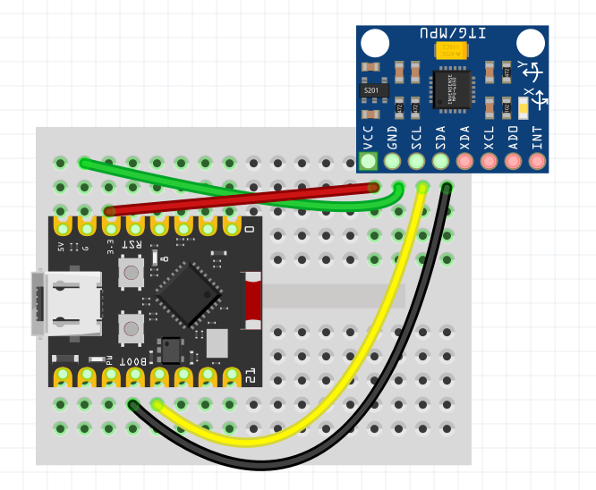

# SmartPoi Accelerometer Controller

This project uses an ESP32 C3 Super Mini board and an MPU-6050 accelerometer to detect "stalls" (pauses in spinning) of SmartPoi devices. When a stall is detected, the controller sends HTTP requests to connected SmartPoi devices to update their display images.

## Features

- Detects "stalls" (pauses in spinning) using MPU-6050 accelerometer data
- Sends HTTP requests to SmartPoi devices to update display images during stalls
- Supports up to 3 configurable WiFi connections for connecting to different SmartPoi devices
- Backup AP mode for configuration when no WiFi networks are available
- Web-based configuration interface for WiFi settings and device management
- Automatic fallthrough connection attempts to multiple configured networks
- Configurable stall detection thresholds and sensitivity
- OTA (Over-the-Air) firmware updates via ElegantOTA
- LittleFS filesystem for persistent configuration storage

## Hardware

* ESP32 C3 Super Mini board
* MPU-6050 Accelerometer
* Breadboard and jumper wires

## Wiring

Connect the MPU-6050 to the ESP32 C3 Super Mini as follows:

| MPU-6050 | ESP32 C3 Super Mini |
|---|---|
| VCC | 3V3 |
| GND | GND |
| SCL | GPIO8 |
| SDA | GPIO9 |



*Breadboard layout showing ESP32 C3 Super Mini connected to MPU-6050 accelerometer*


## Installation

1. **Clone the repository:**
   ```bash
   git clone https://github.com/tomjuggler/SmartPoi_Accelerometer_Controller
   cd SmartPoi_Accelerometer_Controller
   ```

2. **Install PlatformIO:**
   Follow the instructions on the [PlatformIO website](https://platformio.org/install).

3. **Configure WiFi Settings:**
   Create a `secrets.cpp` file in the `src` directory with your primary WiFi credentials:
   ```cpp
   #include "secrets.h"
   
   // Primary WiFi Credentials
   const char* ssid = "YOUR_PRIMARY_WIFI_SSID";
   const char* password = "YOUR_PRIMARY_WIFI_PASSWORD";
   // Debug Mode
   const bool debug_mode = true;  // Set to false for production
   // Rotation Axis (0=X, 1=Y, 2=Z)
   const int rotation_axis = 0;
   ```
   
   **Note:** Additional WiFi networks can be configured via the web interface after initial setup. The device supports up to 3 configurable networks with automatic fallthrough connection attempts.
   
   An example file `secrets_example.txt` is provided in the project root. Rename it to `secrets.cpp`, move it to the `src` directory, and edit with your actual credentials.

4. **Build and Upload:**
   Connect the ESP32 C3 Super Mini to your computer and run the following command:
   ```bash
   platformio run --target upload --target uploadfs
   ```
   This will compile the code, upload it to the ESP32 C3 Super Mini, and upload the LittleFS filesystem image. (Or just use PlatformIO "Build" and "Upload", "Build Filesystem" and "Upload Filesystem" if using VSCode IDE with PlatformIO Extension)

## Usage

### Initial Setup and Configuration

1. **First Boot - AP Mode:**
   - On first boot or when no configured WiFi networks are available (Poi OFF), the ESP32 C3 will start in AP (Access Point) mode
   - Connect your computer or phone to the WiFi network named "SmartPoi-Config" (No Password)
   - Open a web browser and navigate to `http://192.168.4.1` if the page does not open automatically

2. **Web Configuration Interface:**
   - Use the web interface to configure up to 3 WiFi networks that your SmartPoi devices use
   - Set stall detection sensitivity thresholds
   - Configure the HTTP endpoints for your SmartPoi devices
   - Save settings to LittleFS persistent storage

3. **Automatic Connection Attempts:**
   - After configuration, the device will attempt to connect to the first configured WiFi network
   - If connection fails, it will automatically try the next configured network (fallthrough)
   - If all configured networks fail, it returns to AP mode for reconfiguration

### Normal Operation

4. **Stall Detection and Image Updates:**
   - The MPU-6050 continuously monitors rotational motion
   - When a "stall" (pause in spinning) is detected:
     - HTTP POST requests are sent to configured SmartPoi device endpoints
     - SmartPoi devices update their display images based on the stall event
   - When spinning resumes, additional HTTP requests can trigger different image displays

5. **Monitoring and Management:**
   - Connect to the device's web interface (at its assigned IP) to monitor status
   - View connection status, stall detection statistics, and device configuration
   - Update WiFi settings or SmartPoi endpoints as needed
   - Perform OTA firmware updates via the ElegantOTA interface

6. **Serial Monitor Debugging:**
   - For debugging, connect via serial monitor at 115200 baud
   - View detailed connection attempts, stall detection events, and HTTP request logs
   - Debug mode can be enabled/disabled in the secrets.cpp file
